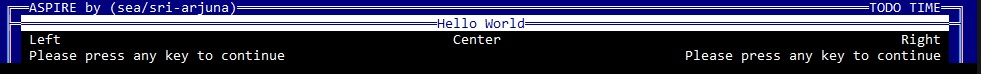

Achieving Seamless Performance In Real-time Environments
================================================================
> **Note:** \
> This is the official rewrite of TUI/SWARM by the original inventor/author Simon Arjuna Erat. \
> Please be aware that this is an unstable work in progress, and some references in this text may refer to habits/behaviour based on the original BASH source code.

Brief
-----
ASPIRE is a Python 3.11+ module that offers an easy to use line-based text user interface framework.


Target Audience
---------------
For developers aiming to enhance the user experience with the console.


Detail
------
ASPIRE simplifies common tasks by providing various functions that wrap around frequently used code. It serves as a three-way interface between the system (MS Windows, any *Nix based system, and even Apple's iOS), the author/developer, and the end user.

One of ASPIRE's key focuses is to enhance the console experience by offering themable designs. You, as the author, can choose from a variety of ASCII-based themes that include colors, symbols, bold and underline fonts, and more. Users also have the option to select a different theme or even create their own.

ASPIRE is designed with simplified usability in mind for both end users and developers. \
These functions aim to streamline interactions and improve the overall experience.

To name a few of these convenient functions:\
All descriptions are based on the default theme.

| Name | Description |
|------|-------------|
| header	| Will print a blue background accross the whole console 'surrounded' by borders.<br>It will accept up to 3 strings.|
| title		| Will print the borders, and fill the space in between with the foreground color (white),<br> and use the background color for the font.<br>This function accepts only 1 string, which will be printed in the center of the line.|
| print		|  Standart output, prints borders in foreground color and accepts up to 3 strings.<br>Will allign them as follows:<br>1. Left<br>2. Left,  Right<br>3. Left, Center, Right |
| ask		| Printing borders and the passed question, encapsules the default ``input``, returns the input. |
| yesno		| Similar to ``ask``, but will only accept yes/no, returns according bool. |
| select	| Pass a list as argument, uses ``list`` to print them. Returns the string of the shown/entered number. |
| list 		| Used by ``select`` to print a number to each item of the list |
| bar 		| Provides a progress bar with different options that can be used within the project. |


Usage
-----

Use as library in your projects like this:

```py
from aspire import Aspire as tui

tui.header("Aspire by (sea/sri-arjuna)", "Date + Time")
tui.title("Hello World")
tui.printe("Left string", "Center string", "Right string")
tui.press()
```

This is how "Hello World" (using ``header``, ``title`` and ``print``) can look like:


There are some test projects in [[examples](./examples)]

----


Installation
------------

At least thats where i want to go:
```
pip install ASPIRE
```


For an example list of different use cases, please see: [[USAGE](./docs/USAGE.md)]

Example:
--------

 How the original BASH shell variant with the classic theme looked like: (just to demonstrate how it might look.

