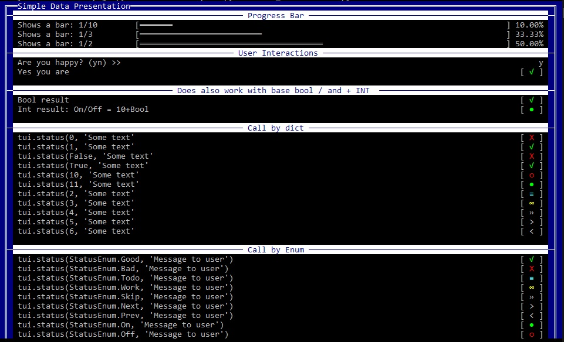

Data Interactions:
==================

In the first section we will handle how to show a ``progressbar``, ``yesno `` questions, and the presentation of ``status`` messages.

| Name 	   | Description |
|----------|-------------|
| progress | By default a basic progressbar, offering 2 alternative modes:  - ``style="num"`` = 'reduces' the progress to a basic number style: ``[ 2 /4 ]`` - ``style="dash"`` prints a simple 'animated dash' to indicate a process is running: ``\ - / \|`` ***(TODO / WIP)*** |
| yesno    | Ask a simple "yes or no" question. It read 1 character and will return ``True`` for 'y' and ``False`` for 'n'. For non-english coders, you can simply pass the equivalent of 'yn' as argument, and till use those as identifiers for 'yesno'. |
| status   | Great to show certain status messages based on *nix based "init" style. It accepts INT, BOOL, and its own ``StatusEnum`` type to print the (mostly) colored symbols.

----

Preview: [[Sample code: Data_Interactions.py](../../..//examples/Data_Interactions.py)]

Creating Menus:
===============

With all the "wizard style" appearance, you might want to provide some menu to your users.

We've got you covered:

| Name 	   | Description |
|----------|-------------|
| ask      | Just a basic wrapper for pythons ``input``
| select   | Will print a ``list`` and auto-return the 
| list     | Prints a list of all passed entries. Does accept: - lists - dict - Enum By default it shows regular INT numbering, but by using ``style=roman`` you can enforce roman-style numbering for a more classic style. |

WIP