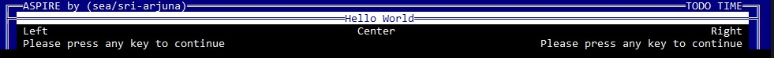

Hello World:
============

If you just need do to some very basic presentation to users, these are the very core functions of ASPIRE.

```py
from aspire import Aspire as tui

tui.header("Aspire by (sea/sri-arjuna)", "Date + Time")
tui.title("Hello World")
tui.printe("Left string", "Center string", "Right string")
tui.press()
```
This will look like:



Syntax:
-------

| Function | Description |
|----------|-------------|
| header   | Accepts 3 strings, whole line will be printed using ``color_bg`` while the font uses ``color_`` |
| title    | Accepts only 1 string, which will be centered. Depending on theme settings, this can be 'regular',  ``bold``, ``italic`` or ``underlined``. For the 'center fill', it uses ``inverted`` color settings. 
| print    | Accepts 3 strings, to print output to left, center and right.

Additional notes:
-----------------

Every function that accepts 3 strings, will align them as follows:
 1. Left
 2. Left,  Right
 3. Left, Center, Right


Most output functions will also accept the keyword argument: ``end=""``. \
As usual, you can use:
- "", to just stay on line
- "\n", actualy the default behaviour, print newline.
- "\r", return to start of line
