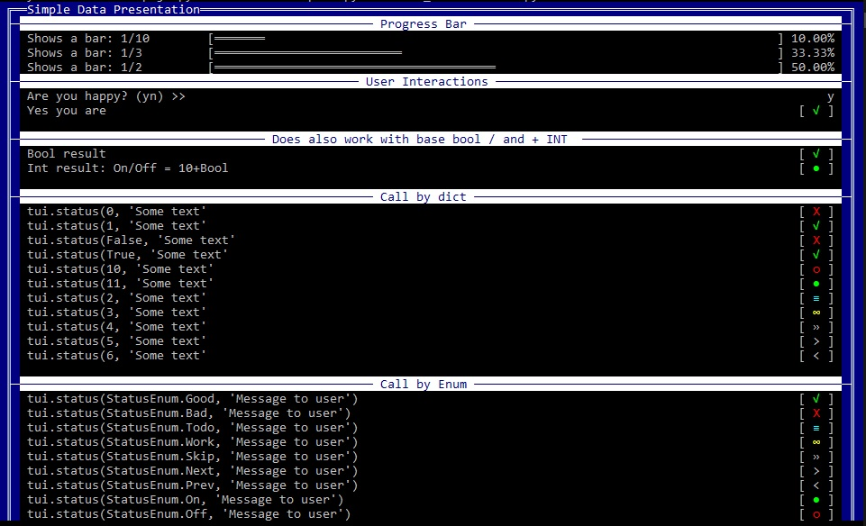

Data Interactions:
==================

In the first section we will handle how to show a ``progressbar``, ``yesno `` questions, and the presentation of ``status`` messages.

Preview:

- [[Sample code: Data_Interactions.py](../../..//examples/Data_Interactions.py)]

WIP