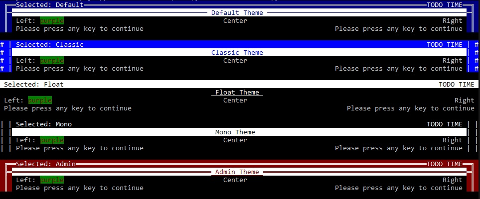

Themes:
=======

This file will explain how themes work internaly and how you can make use of them and even create your own.

### Preview:


- [[Sample code: ThemePreview](../../../examples/ThemePreview.py)]


Theme internals:
----------------

These functions are provided by using the "Theme as theme" class provided by [[aspire_core.py](../../aspire/aspire_core.py)] and retrieve the default themes from [[aspire_data_themes.py](../../aspire/aspire_data_themes.py)].

Upon load / init, the class will attempt to read THEME_PRESET (representing an Enum containing the theme) if it is present, it will be applied to the class attribute "theme.current". \
If no THEME_PRESET is present, the default theme will be applied.


| Attribute  | Description |
|------------|--------------|
| current 	| This is used to access the current theme data. <br>It is recommended to use an alias named ``theme`` upon import, so you can refer to the theme data like: ``theme.current.border_left`` |
| _selected | Assign a string of an existing theme template and use the ``get`` function to update the theme used.

The 'current' attribute is refered to and used by ``print_text`` and ``print_border`` in order to use the accurate theme you have had chosen (or: default). \
They both are executed most often and use a cached function to retrieved updates on both, the theme and the width of the console.

| Function         	| Description |
|------------------	|--------------|
| Theme.get()		| Retrieves the object data from "current" attribute. <br>This will also execute the internal command '_check_empty_variables(obj)'<br>This will also update the values of ''color_fg'' and ''color_bg'' with their according console code.|
| Theme.set(obj)	| Sets the attribute "current" to the provided 'enum' <br> For this work you will need to use: "``from aspire_data_themes import ThemeList``" <br> Now, this is only to  change the theme when the application was started already. <br>If you do want to set a certain theme ast startup, the use of ``THEME_PRESET = Mono`` is recommended. |


Set different theme:
--------------------

Aside of the theme "Default", there are 3 more:
- Classic
- Float
- Mono
- Admin


```py
# Intended use:
from aspire_data_core import Theme as theme
theme._selected = "Float"
theme.get()
```


Use a custom theme:
-------------------


--> THIS IS WORK IN PROGRESS <--


If you intend a different appearance, you can create your very own theme.

However, to do so, you will need to preserve the internal structure by following these steps.

> ***Note:*** \
> The name ``ThemeCustom`` is mandatory at this moment for fallback usage! \
>```Please use octal sequences for special characters such as '<>:;!?\" for prompts, special characters should be avoided for 'borders' alltogether.``` \
> ```This is to preserve cross platform-compatibility.```

```py
# In your import section of course:
from enum import Enum
from dataclasses import dataclass
from aspire_data_themes import ThemeAttributes

# Define your own theme collection
def ThemeCustom(Enum):
	my_theme_1 = ThemeAttributes(
        # border_L/R is the 'default' border,
		# in a fallback sense it title/header_L/R are empty
		# Best used with a string of about 2-4 characters.
		border_left=" ║ ",
        border_right=" ║ ",
        # For easier read (and write) ablity use plain text color names,
		# these will be translated to console code by the use of Color and Text module (cat)
		color_fg="white",
        color_bg="blue",
		# These are octal sequences for some characters that you might like for your promt:
		# \072 == ":"
		# \074 == "<"
		# \076 == ">"
		prompt_read="\072",
        prompt_select="\076\076",
        # Customize your progress bar, allthough possible to use more,
		# I highly recomend to stick to 1 character per field
		bar_empty=" ",
        bar_half="─",
        bar_full="═",
        # Use these if you want a more "dynamic" border
		# Set as empty ("") if they should use the default border_l/r
		title_left=" ╠═",
        title_right="═╣ ",
        header_left=" ╔═",
        header_right="═╗ ",
        # This basicly "fills" the 'header' with this symbol
		# Obviously, any text printed by 'header' will overwrite its specific location
		filler="═"
    )

# Set your custom theme
Theme._current_theme_ = Theme.set(ThemeCustom.my_theme_1)
```

